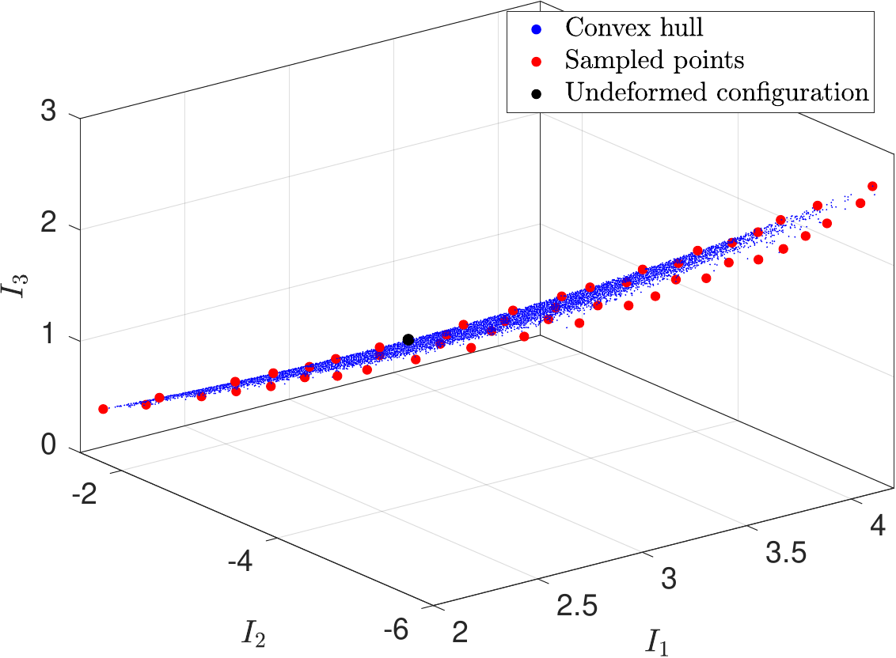
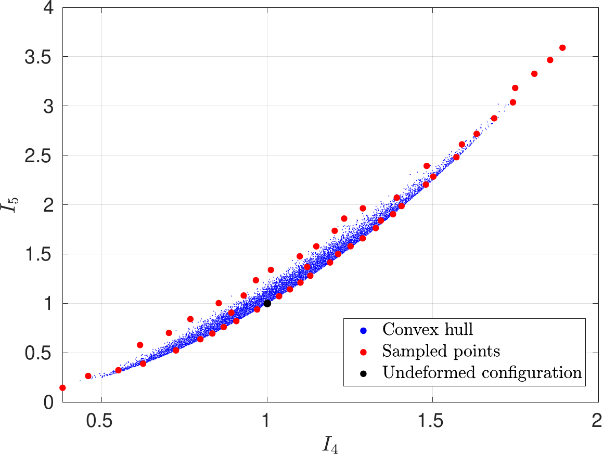

# A sampling approach for generating space-filling samples in invariant space using simulated annealing
A problem associated with training a mapping where inputs are principal and pseudo invariants of the right Cauchy-
Green deformation tensor, is that the sample placement in this space might not be spaced evenly even when sampling
the deformation tensors in a space-filling way. Furthermore, generating samples in a space-filling fashion in a specific
domain of the invariant space has not been sufficiently explored since it is not clear how to define a relevant region.

In [1] a method was proposed that uses simulated annealing to find space-filling samples in invariant space whose positions are constrained by a deformation gradient domain and physical constraints.

<figure class="center">
  
  
</figure>

## Getting Started

Here we provide sampling algorithms for isotropic and trans. isotropic materials using MATLAB.
The algorithm can be started using the file runInvSampling.m

## Prerequisites

Matlab version R2017a or higher.

## References
If you use part of this code consider citing:

[1] Fuhg, Jan Niklas, and Nikolaos Bouklas. "On physics-informed data-driven isotropic and anisotropic constitutive models through probabilistic machine learning and space-filling sampling." Computer Methods in Applied Mechanics and Engineering 394 (2022): 114915.

## License

This package comes with ABSOLUTELY NO WARRANTY. This is free
software, and you are welcome to redistribute it under the conditions of
the GNU General Public License
([GPLv3](http://www.fsf.org/licensing/licenses/gpl.html))

The contents are published under the 
Creative Commons Attribution-NonCommercial-ShareAlike 4.0 International License
([CC BY-NC-SA 4.0](http://creativecommons.org/licenses/by-nc-sa/4.0/))
